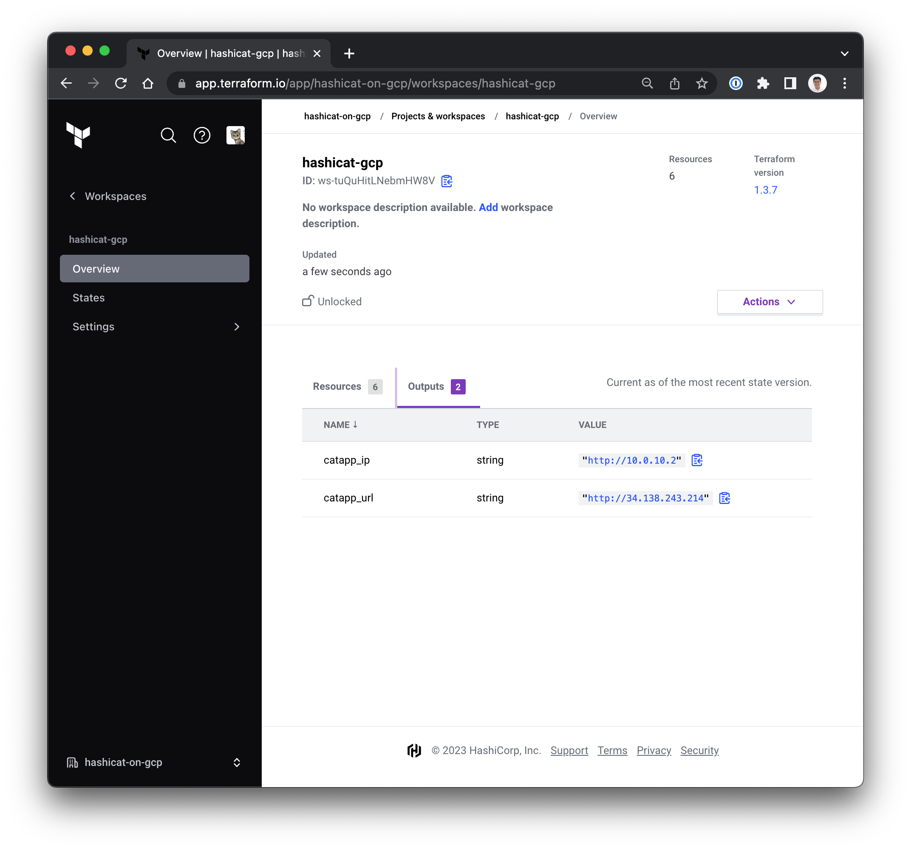

<style>
  v {
    display: inline-flex;
    color: white;
    background-color: rgb(17, 158, 111);
    align-items: center;
    justify-content: center;
    font-size: 14px;
    padding: 10px;
    border-radius: 2px;
    height: 24px;
  }

  r {
    display: inline-flex;
    color: white;
    background-color: #c73445;
    align-items: center;
    justify-content: center;
    font-size: 14px;
    padding: 10px;
    border-radius: 2px;
    height: 24px;
  }

  m {
    display: inline-flex;
    color: white;
    background-color: #584ED5;
    align-items: center;
    justify-content: center;
    font-size: 14px;
    padding: 10px;
    border-radius: 2px;
    height: 24px;
  }

  x {
    display: inline-flex;
    border-radius: 5px;
    border: 1px solid rgba(151,159,175,1);
    /* background-color: rgba(151,159,175,1); */
    /* background-color: rgba(30,38,55,1); */
    color: rgba(151,159,175,1);
    padding: 2px 10px 2px 10px;
    font-size: 14px;
    letter-spacing: 1.2px;
    align-items: center;
    justify-content: center;
    height: 24px;
  }

  t {
    display: inline-flex;
    border-radius: 5px;
    background-color: rgba(30,38,55,1);
    color: rgba(151,159,175,1);
    padding: 2px 10px 2px 5px;
    font-size: 14px;
    letter-spacing: 1.2px;
    align-items: center;
    justify-content: center;
    height: 24px;
  }

  t > a img {
    display: inline-block;
  }
</style>
The objective of this challenge is to configure remote state using your HCP Terraform account.

- When you perform the deployment of the `hashicat-gcp` application, the Terraform code executes on your workstation.

- We want to centralize and secure the associated Terraform state of your deployment in your HCP Terraform workspace.

1- Configure the workspace backend
===
- Use the <t>Code Editor</t> tab and expand the <t>hashicat-gcp</t> folder.

- Open the file <t>remote_backend.tf</t> and confirm your organization name, and your workspace name.

- Edit the file <t>terraform.tfvars</t>:

  * Set the `prefix` variable to your name or a prefered pseudonym. If you use multiple words, use hyphens or underscores between words, and keep it all lower case.

  * Optionally modify the `region` to a valid Google Cloud region such as "us-east1", "us-west1", "europe-west2", or "asia-southeast1".

2- Deploy the hashicat application
===
- In the <t>Terminal</t> tab execute the following commands:

```bash
# Move to our Terraform workspace
cd /root/hashicat-gcp

# Initialize the workspace locally.
terraform init

# Execute the plans and applies on this
# workstation. At this stage, Terraform
# Cloud is only used to store and
# synchronize state.
terraform apply -auto-approve


```

- When completed, you can follow the `catapp_ip`, or the `catapp_url`, link to open the application instance.

3- See results in HCP Terraform
===
- On the HCP Terraform portal, navigate to <x>Projects & workspaces</x>-<x>[[ Instruqt-Var key="TF_WORKSPACE" hostname="workstation" ]]</x>-<x>Overview</x> and click on <x>Outputs</x>. Please see the example image below.



- From the user interface, you can follow the `catapp_ip`, or the `catapp_url`, link to open the application instance.

- On the HCP Terraform portal, navigate to <x>Projects & workspaces</x>-<x>[[ Instruqt-Var key="TF_WORKSPACE" hostname="workstation" ]]</x>-<x>States</x>. Please see the example image below.


- Open the state file to view your deployment data.

---

Well done!

- You successfully deployed the `hashicat-gcp` application.

- The Terraform state is stored securely in the HCP Terraform platform.

Report to Robin by clicking the <v>Check</v> button for this challenge.